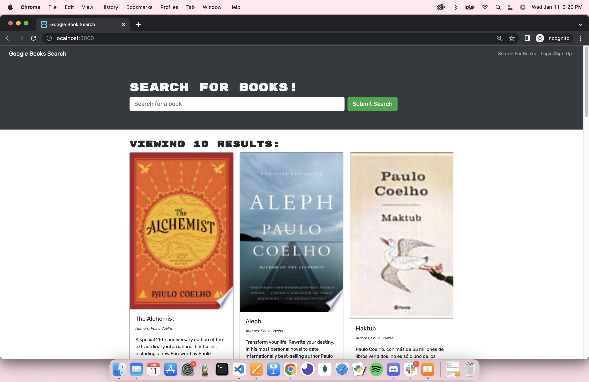
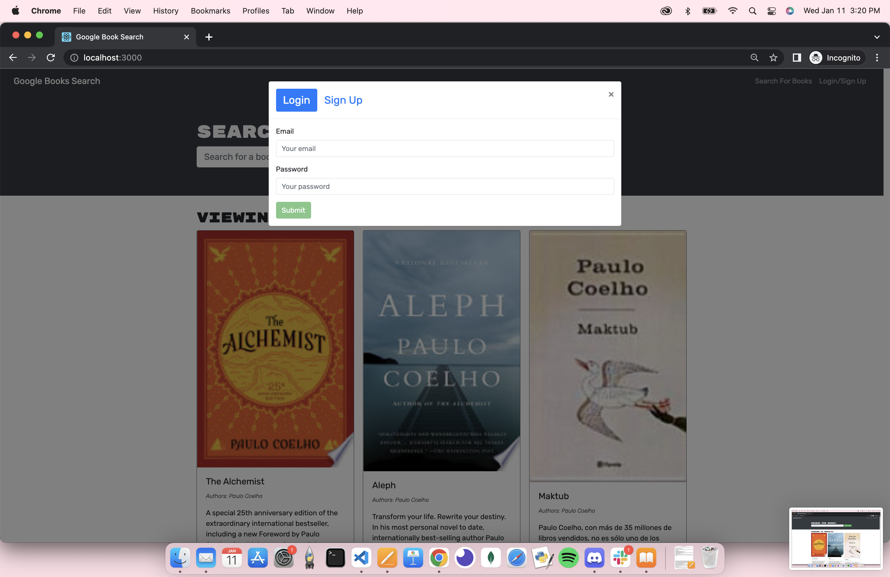
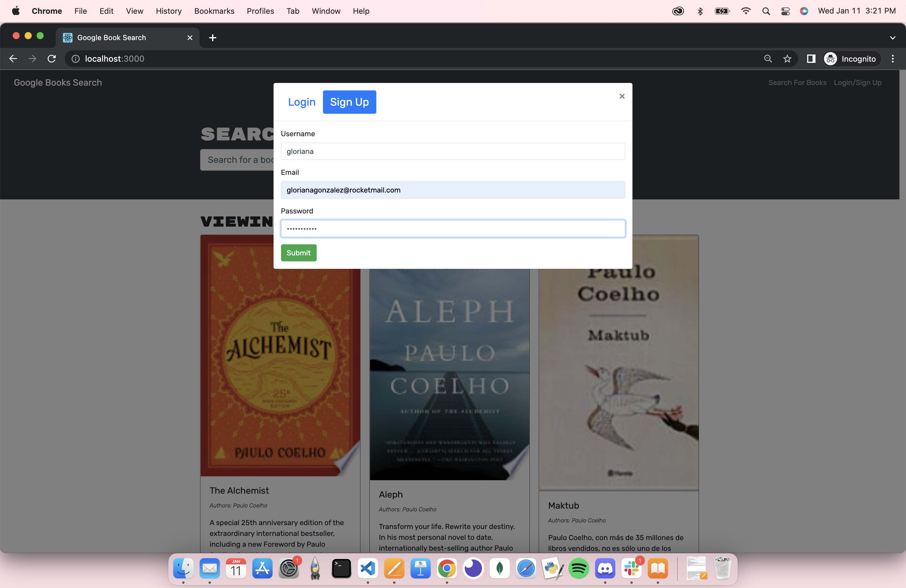

# Book Search Engine 
- Refactored a fully functioning Google Books API search engine built with a RESTful API, to be a GraphQL API built with Apollo Server.

# Objectives
A search book engine that when loaded:
- Presents a menu with the options Search for Books and Login/Signup and an input field to search for books and a submit button
- Presents an input field to search for books and a submit button when clicking on the search for books menu
- When a user is not logged and enters a search term in the input field and clicks the submit button it is presented with several search results, each featuring a book’s title, author, description, image, and a link to that book on the Google Books site
- When a user clicks on the login/signup option, a modal appears on the screen with a toggle between the option to log in or sign up
- When toggling to signup, user is presented with three inputs for a username, an email address, and a password, and a signup button
- Wehn toggling to login, user is presented with two inputs for an email address and a password and login button
- When the user enters a valid email address and create a password and click on the signup button, an account is created and the usser is logged in to the site
- When the user enters their account’s email address and password and click on the login button, the modal closes and the user is logged into the site
- When logged in to the site the menu options change to Search for Books, an option to see saved books, and logout
- When logged in and enter a search term in the input field and click the submit button, the user is presented with several search results, each featuring a book’s title, author, description, image, and a link to that book on the Google Books site and a button to save a book to their account
- When the user clicks on the save button on a book, that book’s information is saved to their account
- When clicking on the option to see all saved books, the user is presented with all of the books they have saved to their account, each featuring the book’s title, author, description, image, and a link to that book on the Google Books site and a button to remove a book from their account
- When the user clicks on the remove button on a book, that book is deleted from their saved books list
- When the user clicks on the logout button, they are logged out of the site and presented with a menu with the options Search for Books and login/signup

# Usage
- From the command line:
    - Run `npm i`
    - Run `npm run seed`
    - Run `npm run start`
    - A browser will open at `http://localhost:3000/`
        - if another application opens, use an icognito window

# Technologies
- "@apollo/client": "^3.5.8",
- "@testing-library/jest-dom": "^4.2.4",
- "@testing-library/react": "^9.3.2",
- "@testing-library/user-event": "^7.1.2",
- "bootstrap": "^4.4.1",
- "graphql": "^15.4.0",
- "jwt-decode": "^2.2.0",
- "react": "^16.13.1",
- "react-bootstrap": "1.0.1",
- "react-dom": "^16.13.1",
- "react-router-dom": "^6.2.1",
- "react-scripts": "^4.0.2"

# Images

